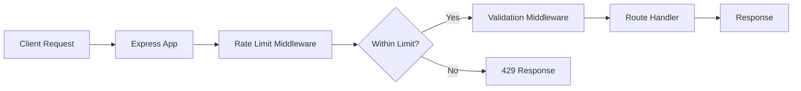
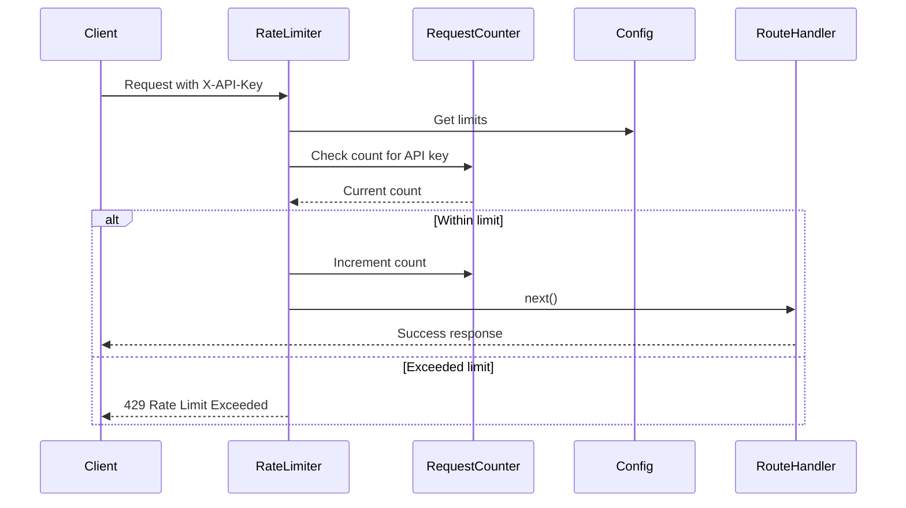

# Design Document: Per-API Key Rate Limiting

## Overview

This design implements a per-API key rate limiting system for the Stellar Micro-Donation API using the sliding window counter algorithm. The system tracks request counts per API key within configurable time windows and enforces limits to prevent abuse while maintaining high performance for legitimate traffic.

The rate limiter is implemented as Express middleware that integrates seamlessly with the existing middleware chain. It uses an in-memory data structure for request tracking, making it suitable for single-instance deployments and testing environments.

## Architecture

### High-Level Architecture



### Component Interaction



### Design Decisions

1. **In-Memory Storage**: Using a JavaScript Map for request tracking provides O(1) lookup performance and simplifies implementation. This is appropriate for single-instance deployments and can be extended to Redis for distributed systems.

2. **Sliding Window Counter**: This algorithm provides accurate rate limiting while being memory efficient. Each API key stores only the count and window start time.

3. **Middleware Pattern**: Implementing as Express middleware ensures easy integration and follows the existing architectural pattern in the codebase.

4. **Environment-Based Configuration**: Using environment variables allows operators to adjust limits without code changes, supporting different limits for development, staging, and production.

## Components and Interfaces

### RateLimiter Middleware

The main middleware function that enforces rate limits.

**Interface:**
```javascript
function rateLimiter(options = {}) {
  // Returns Express middleware function
  return function(req, res, next) {
    // Implementation
  }
}
```

**Parameters:**
- `options.limit` (number, optional): Maximum requests per window (default: from config)
- `options.windowMs` (number, optional): Time window in milliseconds (default: from config)
- `options.skipFailedRequests` (boolean, optional): Don't count failed requests (default: false)

**Behavior:**
1. Extract API key from `X-API-Key` header
2. Validate API key presence
3. Check current request count for the API key
4. If within limit: increment counter and call `next()`
5. If exceeded: return 429 error response
6. Add rate limit headers to response

### RequestCounter

Manages request counts per API key with time window tracking.

**Interface:**
```javascript
class RequestCounter {
  constructor(windowMs)
  
  // Check if API key is within rate limit
  isWithinLimit(apiKey, limit)
  
  // Increment request count for API key
  increment(apiKey)
  
  // Get current count for API key
  getCount(apiKey)
  
  // Get time until window reset for API key
  getTimeUntilReset(apiKey)
  
  // Clean up expired entries
  cleanup()
  
  // Reset all counters (for testing)
  reset()
}
```

**Internal State:**
```javascript
{
  counters: Map<string, CounterEntry>
}

type CounterEntry = {
  count: number,
  windowStart: number  // timestamp in milliseconds
}
```

**Behavior:**
- Maintains a Map of API keys to counter entries
- Automatically resets counts when time window expires
- Periodically cleans up expired entries to prevent memory leaks
- Thread-safe for concurrent requests (JavaScript single-threaded nature)

### Configuration Module

Provides rate limiting configuration with validation.

**Interface:**
```javascript
const rateLimitConfig = {
  limit: number,           // Max requests per window
  windowMs: number,        // Time window in milliseconds
  cleanupIntervalMs: number // How often to clean expired entries
}

function loadRateLimitConfig()
function validateRateLimitConfig(config)
```

**Environment Variables:**
- `RATE_LIMIT_MAX_REQUESTS`: Maximum requests per window (default: 100)
- `RATE_LIMIT_WINDOW_MS`: Time window in milliseconds (default: 60000 = 1 minute)
- `RATE_LIMIT_CLEANUP_INTERVAL_MS`: Cleanup interval (default: 300000 = 5 minutes)

**Validation Rules:**
- `limit` must be a positive integer
- `windowMs` must be a positive integer >= 1000 (minimum 1 second)
- `cleanupIntervalMs` must be a positive integer

### Error Response Builder

Constructs standardized error responses for rate limiting failures.

**Interface:**
```javascript
function buildRateLimitError(apiKey, limit, resetTime)
function buildMissingApiKeyError()
```

**Response Format:**
```javascript
{
  success: false,
  error: {
    code: string,        // 'RATE_LIMIT_EXCEEDED' or 'MISSING_API_KEY'
    message: string,     // Human-readable error message
    limit: number,       // Rate limit value (for RATE_LIMIT_EXCEEDED)
    resetAt: string      // ISO timestamp when limit resets (for RATE_LIMIT_EXCEEDED)
  }
}
```

## Data Models

### CounterEntry

Represents the request tracking data for a single API key.

```javascript
{
  count: number,          // Number of requests in current window
  windowStart: number     // Unix timestamp (ms) when current window started
}
```

**Lifecycle:**
1. Created when first request from API key arrives
2. Count incremented on each request within window
3. Reset when time window expires
4. Removed during cleanup if expired and not accessed

### Rate Limit Headers

Standard HTTP headers included in all responses:

```javascript
{
  'X-RateLimit-Limit': string,      // Maximum requests allowed
  'X-RateLimit-Remaining': string,  // Requests remaining in window
  'X-RateLimit-Reset': string       // Unix timestamp when limit resets
}
```

### Configuration Object

```javascript
{
  limit: number,                    // Maximum requests per window
  windowMs: number,                 // Time window duration in milliseconds
  cleanupIntervalMs: number,        // Interval for cleaning expired entries
  skipFailedRequests: boolean       // Whether to count failed requests
}
```

## Correctness Properties

*A property is a characteristic or behavior that should hold true across all valid executions of a system—essentially, a formal statement about what the system should do. Properties serve as the bridge between human-readable specifications and machine-verifiable correctness guarantees.*


### Property 1: API Key Identification and Tracking

*For any* request with a valid `X-API-Key` header, the rate limiter should extract the API key value and use it as the identifier for tracking request counts, such that multiple requests with the same API key increment the same counter.

**Validates: Requirements 1.1, 1.4**

### Property 2: Request Count Increment

*For any* valid request with an API key, the request counter should increment the count for that API key by exactly one.

**Validates: Requirements 2.1**

### Property 3: Timestamp Storage

*For any* API key with recorded requests, the request counter should store timestamp information that can be retrieved for time window calculations.

**Validates: Requirements 2.2**

### Property 4: Window Expiration Reset

*For any* API key, when the time window expires, the request counter should reset the count to zero for subsequent requests.

**Validates: Requirements 2.3**

### Property 5: API Key Isolation

*For any* two distinct API keys, incrementing the request count for one key should not affect the request count of the other key, and one key reaching its rate limit should not prevent the other key from making requests.

**Validates: Requirements 2.4, 3.3**

### Property 6: Sequential Request Counting

*For any* sequence of N requests with the same API key made within a time window, the final count for that API key should equal N.

**Validates: Requirements 2.5**

### Property 7: Rate Limit Enforcement

*For any* API key, when the request count is below the configured limit, requests should be allowed (status 200-299), and when the count equals or exceeds the limit, requests should be rejected with status 429.

**Validates: Requirements 3.1, 3.2**

### Property 8: Configuration Respect

*For any* configured rate limit and time window values, the rate limiter should enforce those exact values rather than hardcoded defaults.

**Validates: Requirements 3.4, 3.5**

### Property 9: Rate Limit Error Response Completeness

*For any* request rejected due to rate limit exceeded, the error response should include error code `RATE_LIMIT_EXCEEDED`, the current rate limit value, and the time remaining until reset.

**Validates: Requirements 4.2, 4.3, 4.4**

### Property 10: Rate Limit Headers Presence

*For any* response (success or failure), the response should include the HTTP headers `X-RateLimit-Limit`, `X-RateLimit-Remaining`, and `X-RateLimit-Reset` with valid values.

**Validates: Requirements 4.5**

### Property 11: Middleware Flow Control

*For any* request, if rate limiting passes, the middleware should call next() to continue the chain, and if rate limiting fails, the middleware should not call next() and should send an error response instead.

**Validates: Requirements 5.3, 5.4**

### Property 12: Cleanup Removes Expired Entries

*For any* set of API keys with expired time windows, running the cleanup operation should remove those entries from memory, reducing the total number of stored counter entries.

**Validates: Requirements 8.3**

## Error Handling

### Error Scenarios

1. **Missing API Key**
   - Status Code: 401 Unauthorized
   - Error Code: `MISSING_API_KEY`
   - Message: "API key is required. Please provide X-API-Key header"
   - No rate limit headers included

2. **Empty API Key**
   - Status Code: 401 Unauthorized
   - Error Code: `MISSING_API_KEY`
   - Message: "API key cannot be empty"
   - No rate limit headers included

3. **Rate Limit Exceeded**
   - Status Code: 429 Too Many Requests
   - Error Code: `RATE_LIMIT_EXCEEDED`
   - Message: "Rate limit exceeded. Please try again later"
   - Includes: limit, resetAt timestamp
   - Includes: All rate limit headers

4. **Invalid Configuration**
   - Logged at startup
   - Falls back to default values
   - Does not prevent server startup

### Error Response Examples

**Missing API Key:**
```json
{
  "success": false,
  "error": {
    "code": "MISSING_API_KEY",
    "message": "API key is required. Please provide X-API-Key header"
  }
}
```

**Rate Limit Exceeded:**
```json
{
  "success": false,
  "error": {
    "code": "RATE_LIMIT_EXCEEDED",
    "message": "Rate limit exceeded. Please try again later",
    "limit": 100,
    "resetAt": "2024-01-15T10:30:00.000Z"
  }
}
```

**Response Headers:**
```
X-RateLimit-Limit: 100
X-RateLimit-Remaining: 0
X-RateLimit-Reset: 1705315800
```

### Error Recovery

- **Expired Windows**: Automatically reset on next request
- **Memory Cleanup**: Periodic cleanup prevents memory exhaustion
- **Configuration Errors**: Use safe defaults and log warnings
- **Concurrent Requests**: JavaScript single-threaded nature prevents race conditions

## Testing Strategy

### Dual Testing Approach

This feature requires both unit tests and property-based tests for comprehensive coverage:

- **Unit tests**: Verify specific examples, edge cases (missing/empty API keys), and error conditions
- **Property tests**: Verify universal properties across all inputs (rate limiting behavior, counter isolation, header presence)

### Property-Based Testing

We will use **fast-check** (JavaScript property-based testing library) to implement the correctness properties defined above. Each property test will:

- Run a minimum of 100 iterations with randomized inputs
- Reference its corresponding design document property
- Use the tag format: **Feature: donation-rate-limiting, Property N: [property text]**

### Unit Testing Focus

Unit tests should focus on:

- Specific examples demonstrating correct behavior (e.g., "allows 100 requests then blocks 101st")
- Edge cases: missing API key, empty API key, malformed headers
- Integration with existing validation middleware
- Configuration loading and validation
- Error response format verification
- Cleanup operation correctness

### Test Configuration

For faster test execution:
- Use shorter time windows (e.g., 1000ms instead of 60000ms)
- Provide reset() method to clear counters between tests
- Allow configuration overrides in test environment
- Mock time functions for deterministic window expiration tests

### Property Test Examples

**Property 1: API Key Identification**
```javascript
// Feature: donation-rate-limiting, Property 1: API Key Identification and Tracking
fc.assert(
  fc.property(fc.string(), fc.array(fc.anything()), (apiKey, requests) => {
    // Test that same API key increments same counter
  })
);
```

**Property 7: Rate Limit Enforcement**
```javascript
// Feature: donation-rate-limiting, Property 7: Rate Limit Enforcement
fc.assert(
  fc.property(fc.string(), fc.integer({min: 1, max: 200}), (apiKey, limit) => {
    // Test that requests below limit pass, at/above limit fail
  })
);
```

### Integration Testing

- Test rate limiter with existing validation middleware
- Verify middleware ordering (rate limit before validation)
- Test with actual Express app and donation endpoints
- Verify no interference with existing functionality

### Performance Testing

While not part of automated unit/property tests:
- Measure middleware execution time (target: <10ms for 95% of requests)
- Load test with 1000+ requests per second
- Monitor memory usage during extended operation
- Verify cleanup prevents memory leaks
