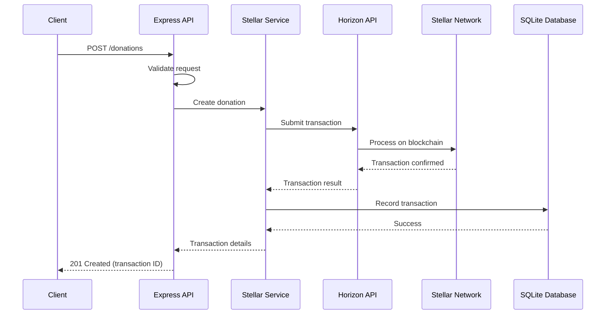
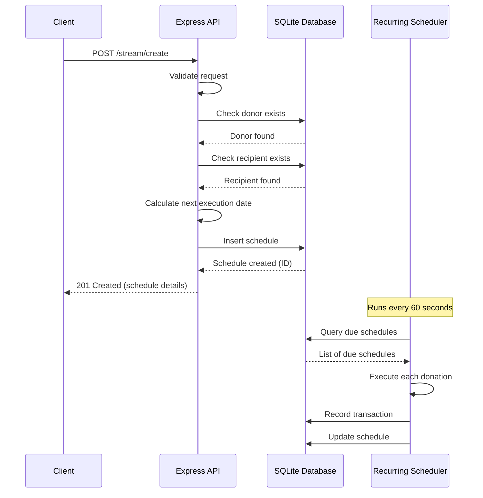
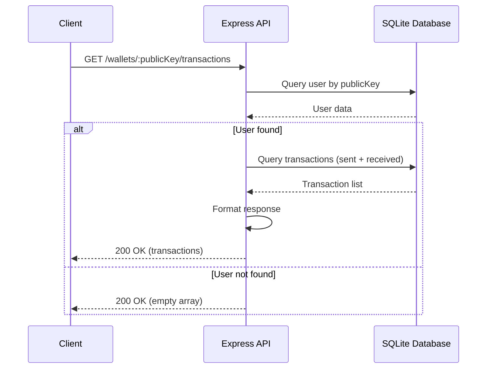
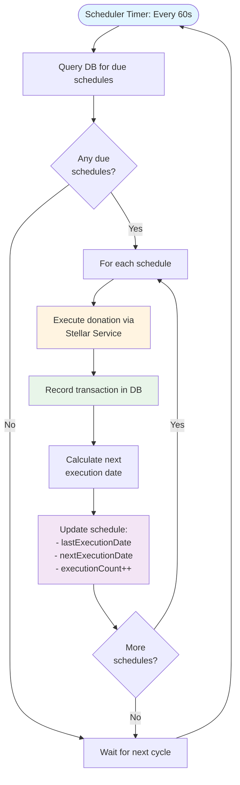
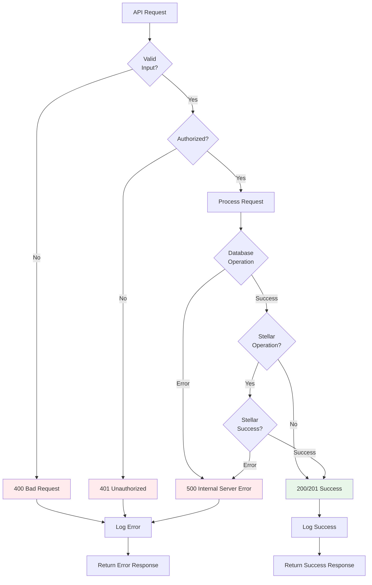
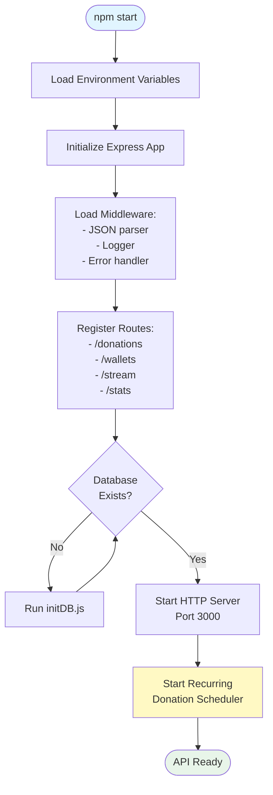
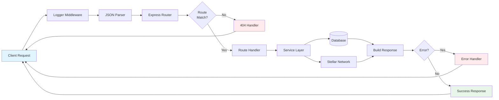

# API Flow Diagrams

## One-Time Donation Flow

## Recurring Donation Creation Flow

## Wallet Transaction Query Flow

## Recurring Donation Execution Flow

## Error Handling Flow

## System Startup Flow

## Database Initialization Flow

```mermaid
flowchart TD
    Start([npm run init-db]) --> CheckDir{Data directory<br/>exists?}
    
    CheckDir -->|No| CreateDir[Create data/ directory]
    CreateDir --> CheckDB
    
    CheckDir -->|Yes| CheckDB{Database<br/>exists?}
    
    CheckDB -->|Yes| Skip[Skip - Already initialized]
    Skip --> End
    
    CheckDB -->|No| CreateDB[Create stellar_donations.db]
    CreateDB --> CreateUsers[Create users table]
    CreateUsers --> CreateTx[Create transactions table]
    CreateTx --> CreateRecurring[Create recurring_donations table]
    CreateRecurring --> InsertSample[Insert sample data]
    InsertSample --> Verify[Verify tables created]
    Verify --> Success([✓ Initialization Complete])
    
    style Start fill:#e1f5ff
    style Success fill:#e8f5e9
    style Skip fill:#fff9c4
```

## Request/Response Lifecycle

